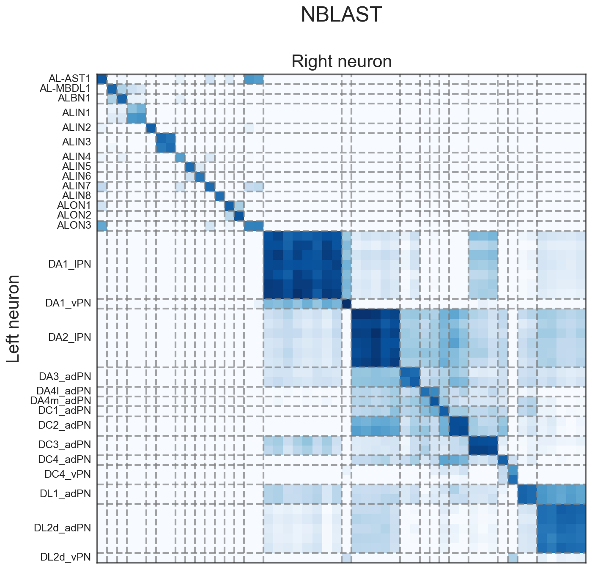
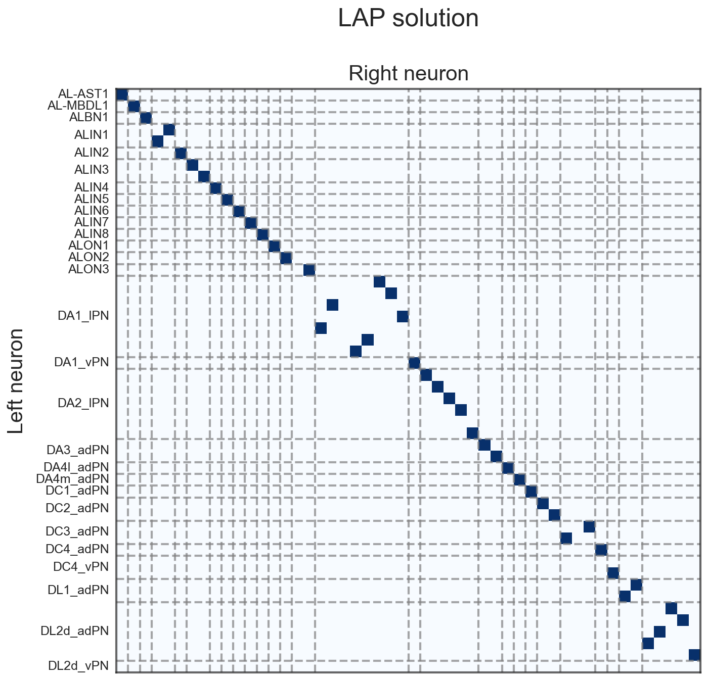
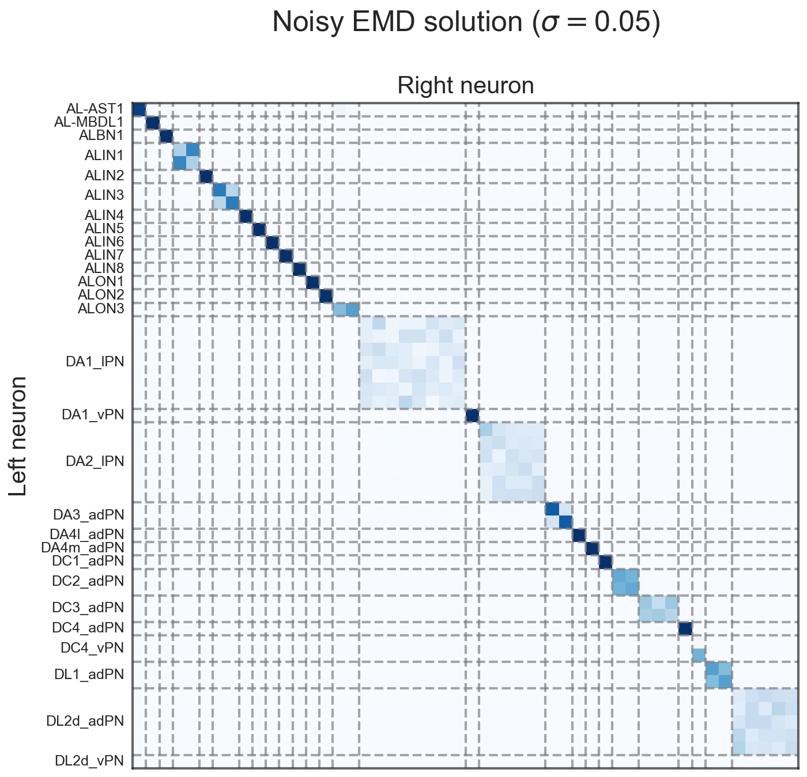
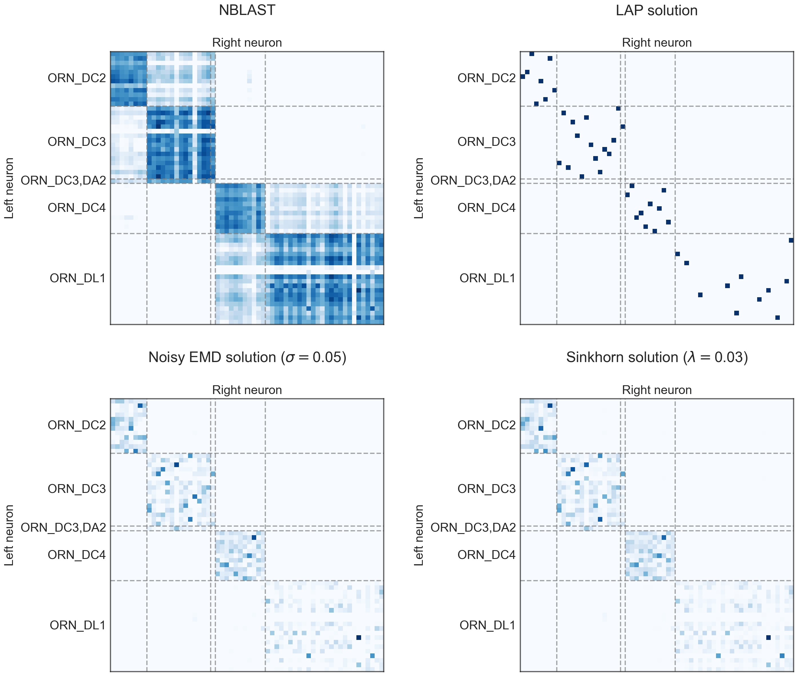
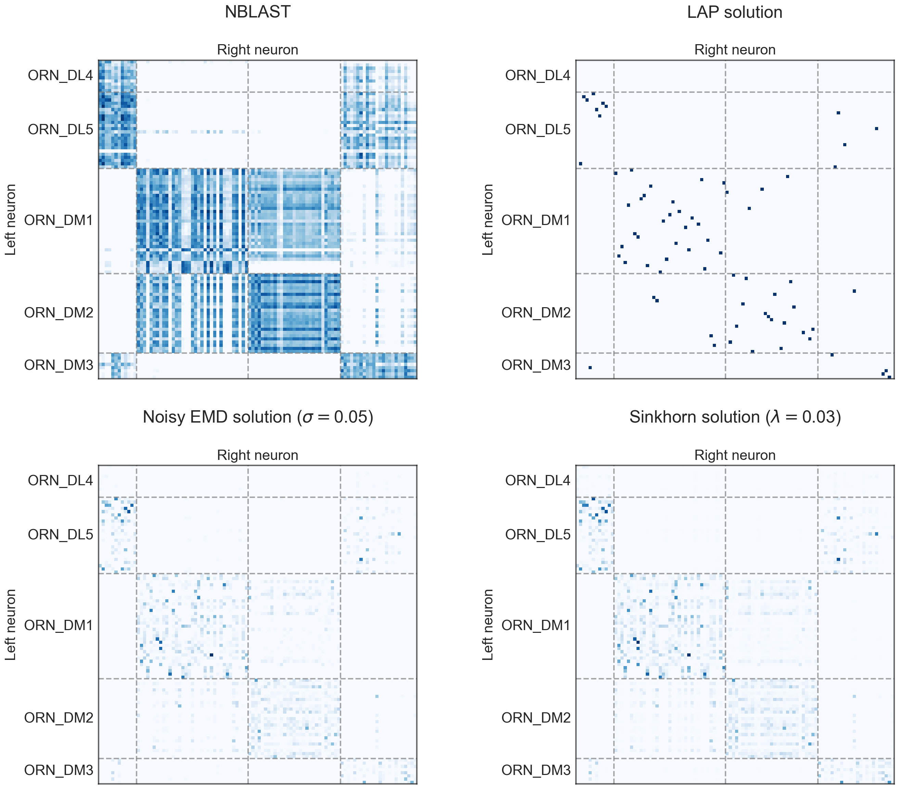
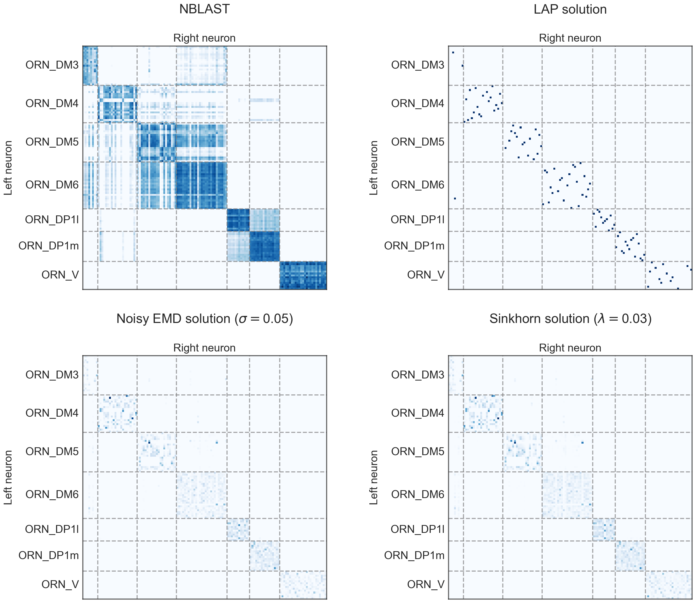

<!-- _paginate: false -->

# Cambridge Hackathon

 

## Benjamin D. Pedigo
_(he/him)_
_[NeuroData lab](https://neurodata.io/)_
_Johns Hopkins University - Biomedical Engineering_

 [_bpedigo@jhu.edu_](mailto:bpedigo@jhu.edu)
 [_@bdpedigo (Github)_](https://github.com/bdpedigo)
 [_@bpedigod (Twitter)_](https://twitter.com/bpedigod)
 [_bdpedigo.github.io_](https://bdpedigo.github.io/)

---

# Cell types

---

# Cell types and "distribution shift"

---
# Matters for both "inductive" and "de novo" cell typing

- E.g. mapping labels from one dataset onto another via a matching, or
- Creating new labels by clustering on a unified representation of datasets

---
# Antennal lobe as a test case
- Using FlyWire data
- Trying to match left/right
- ~1750 neurons per side
- Has good labels to use for evaluation

---

# NBLAST clustering suggests this could be happening

---

# NBLAST embedding

---

# How to line things up, based on NBLAST?

Say we have sets of objects $I = \{i : i=1,...,n\}$ and $J = \{j : j=1,...,m\}$

For example, $I$ is the set of neurons on the left, $J$ those on the right.

Say $S$ is a $n \times m$ matrix such that $S_{ij}$ has the NBLAST score between neuron $i$ (left) and neuron $j$ (right)

---

# Linear assignment problem

$$\max_{P} trace(S P^T) = \max_{P} \sum_{ij} S_{ij} P_{ij} $$

- $P$ is a permutation matrix.
- $P_{ij}$ is 1 if $i \leftrightarrow j$, 0 otherwise.

## Intuition:
Maximize the total NBLAST scores of neurons which are matched, over the set of all matchings.

$P^T$ reshuffles the columns of $S$ to make the diagonal big

---

---

# Issue with a "hard" matching?

---

# Issue with a "hard" matching?

---

# Smoother matchings

Or, how stable are these matchings?

- Add i.i.d. Gaussian noise to NBLAST matrix, $\tilde{S}_{ij} = S_{ij} + Normal(0, 0.05)$
- Run linear assignment problem, get $P^*$
- Take the average of 100 runs of the above.

---

---

# Regularized optimal transport

$$\max_{D} trace(S D^T) + \lambda \Omega(D)$$

- $D$ is a transportation matrix, i.e. rows/columns sum to 1, and $D_{ij}$ represents the amount of "flow" or matching weight from $i$ to $j$.
- $\Omega(D)$ is a regularizer which promotes "smooth" solutions (i.e. not 0-1),
- and $\lambda$ is a weight on the regularization.

## Intuition
Maximize the NBLAST scores of soft-matched neurons, weighted by how strongly those neurons are matched, over the set of (somewhat smooth) soft matchings

---

---

# Benefit (hopefully) of a smoother matching

---

# Benefit (hopefully) of a smoother matching

<!-- ---

# Optimal transport

## Earth mover's distance

The "cost" of moving a unit of mass from $i$ to $j$ is given by $d_{ij}$.

We seek a set of "flows" $f_{ij}$ which minimizes the overall cost 

$$\min_F \sum_{ij} f_{ij} d_{ij} = trace(F^TD)$$ -->

<!-- If $D_{ij}$ is the NBLAST cost of matching $i$ and $j$... -->

---

---

---

---

# What if we want to include connectivity?

## Cosine similarity:

for two vectors, $a$ and $b$...

$$cos(a,b) = \frac{<a, b>}{\|a\| \|b\|} = \frac{a^T b}{\|a\| \|b\|}$$

if we have a bunch of vectors stored in the matrices $A$ and $B$, then

$$C = A^T B$$

since $C_{ij} = \sum_k a_{ki} b_{kj}$

---
# Graph matching

$$ C = A^T I B $$

where $I$ is the identity matrix - this represents a belief about the permutation of rows of $B$ with respect to $A$... so more generally, could write:

$$C = A^T P B$$

Much like before, if we want to measure the "matchedness"

$$\max_P trace(CP^T) = trace(A^TPBP^T)$$

Can show this is equivalent to:

$$\min_P \|A - PBP^T\|_F$$

---

# Accuracy on known labels

---

# Connectivity score (low is good)

---

# NBLAST score (high is good)

---

# Can we tell when we're wrong?

---

# Can we tell when we're wrong?

For optimal transport on NBLAST, and grouping by label on the left side:

---

---

---

---

# TODOs

- Generalizing to more than 2 datasets at a time
- Scaling experiments
  - Optimal transport runs on central brain in ~minutes (on laptop)
  - Need to see whether graph matching can scale to that size
- Seeds/soft seeds?
  - Using pre-known matchings in the optimization

---
# Appendix 

---

# Using this rough assignment to induce a matching for connectivity

$$A^T F B$$

where $F$ is the transportation solution we found above, which roughly maps neurons together based on their NBLAST similarity

---

---

---

---

